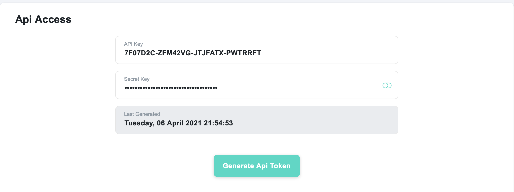

# Welcome to dword
> An amazing library to create synthetic videos


## Installation

Install the dword library

```python
pip install dword
```

Make sure you have [ffmpeg installed](https://ffmpeg.org/download.html).

## Quick start

### Step 1: Use api keys to login

Start by [logging into your DeepWord account](https://login.deepword.co/user/signin) and generating API keys



Use these keys to login to your DeepWord account via the Python api

```python
from dword.core import DeepWord
```

```python
acc = DeepWord(API_KEY, SECRET_KEY)
```

    login successful


Now, make sure that you have enough credits available to generate synthetic videos.

```python
acc.available_credits
```


    9942


### Step 2: Start creating videos

**That's it!!!!**

You can now start creating synthetic videos. All you need is a video of the person talking and the audio you want them to say. In this quick start tutorial, we will use a video and audio we already have. 

To learn more about different ways to use video and audio, refer our [tutorial here](https://deep-word.github.io/dword/tutorials.input_types).

```python
acc.generate_video('Anna.mp4', 'my_audio.mp3', title = 'first_deepword_video.mp4')
```

    Generating video. This will take a few minutes.


    {'status': True,
     'message': 'Your video has been added to the queue for processing. Please check back in 10-15 minutes',
     'url': 'https://staging.deepword.co/video/u5mjcy5ko9e23m1'}




```python
acc.list_videos()[-1]
```


    {'email': 'blablabla@yopmail.com',
     'thumbnail': 'video_u5mjcy5ko9e23m1.mp4',
     'title': 'first_deepword_video.mp4',
     'video_url': 'https://videos-deep-word123.s3.us-east-2.amazonaws.com/output_data/u5mjcy5ko9e23m1.mp4',
     'video_duration': '30.0000',
     'video_id': 'u5mjcy5ko9e23m1',
     'generate_date': '2021-05-04T02:04:26.000Z',
     'output_status': 'Queued'}


Once the status changes from 'Queued' to 'Completed' you can either use `acc.download_video` or `acc.download_all_videos` to download your video.

```python
acc.download_all_videos()
```

    Successfully downloaded all videos in folder downloaded_videos!

